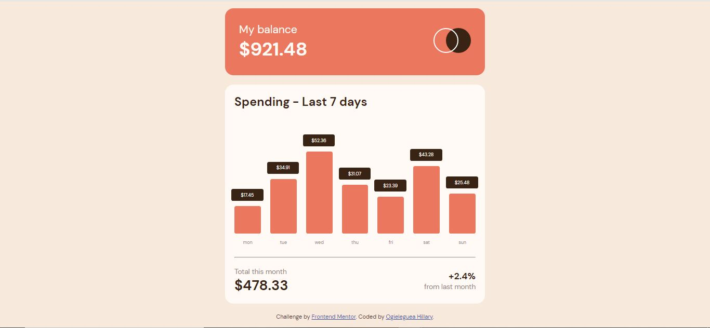
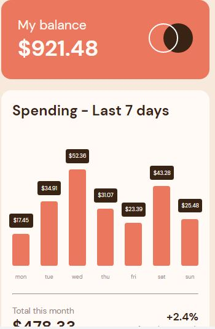

# Frontend Mentor - Expenses chart component solution

This is a solution to the [Expenses chart component challenge on Frontend Mentor](https://www.frontendmentor.io/challenges/expenses-chart-component-e7yJBUdjwt). Frontend Mentor challenges help you improve your coding skills by building realistic projects.

## Table of contents

- [Overview](#overview)
  - [The challenge](#the-challenge)
  - [Screenshot](#screenshot)
  - [Links](#links)
- [My process](#my-process)
  - [Built with](#built-with)
  - [What I learned](#what-i-learned)
  - [Continued development](#continued-development)
  - [Useful resources](#useful-resources)
- [Author](#author)

## Overview

### The challenge

Users should be able to:

- View the bar chart and hover over the individual bars to see the correct amounts for each day
- See the current day’s bar highlighted in a different colour to the other bars
- View the optimal layout for the content depending on their device’s screen size
- See hover states for all interactive elements on the page
- Use the JSON data file provided to dynamically size the bars on the chart

### Screenshot




### Links

- Solution URL: [https://github.com/HillaryWebb-coder/expenses-chart](https://github.com/HillaryWebb-coder/expenses-chart)
- Live Site URL: [https://expenses-application-chart.netlify.app/](https://expenses-application-chart.netlify.app/)

## My process

### Built with

- Semantic HTML5 markup
- CSS custom properties
- Flexbox
- Mobile-first workflow
- Vanilla Javascript

### What I learned

I was able to learn how to use css variables and how to change the content of the before and after pseudo elements using javascript

```css
:root {
  --softred: hsl(10, 79%, 65%);
  --cyan: hsl(186, 34%, 60%);
  --darkbrown: hsl(25, 47%, 15%);
  --mediumbrown: hsl(28, 10%, 53%);
  --cream: hsl(27, 66%, 92%);
  --paleorange: hsl(33, 100%, 98%);
}
```

```js
const expenseBlock = document.createElement("div");
expenseBlock.classList.add("expense-block");
```

```js
data.map((expense) => {
  expenseBlock.style.height = `${expense.amount * 3}px`;
  expenseBlock.title = `$${expense.amount}`;
  expenseBlock.id = `${expense.day}`;
  chart.innerHTML += expenseBlock.outerHTML;
  console.log(expenseBlock.style.height);
});
```

### Continued development

- Create a React app with this to enable users add expenses to the application

### Useful resources

- [How change content value of pseudo :before element by Javascript duplicate](https://stackoverflow.com/questions/10495243/how-change-content-value-of-pseudo-before-element-by-javascript) - This helped me know that we could use the attr function to dynamically change our css values based on html attributes and then use javascript to change the attributes

## Author

- Website - [Ogieleguea Hillary](https://www.github.com/hillarywebb-coder)
- Frontend Mentor - [@hillarywebb-coder](https://www.frontendmentor.io/profile/hillarywebb-coder)
- Twitter - [@OgielegueaH](https://www.twitter.com/OgielegueaH)
